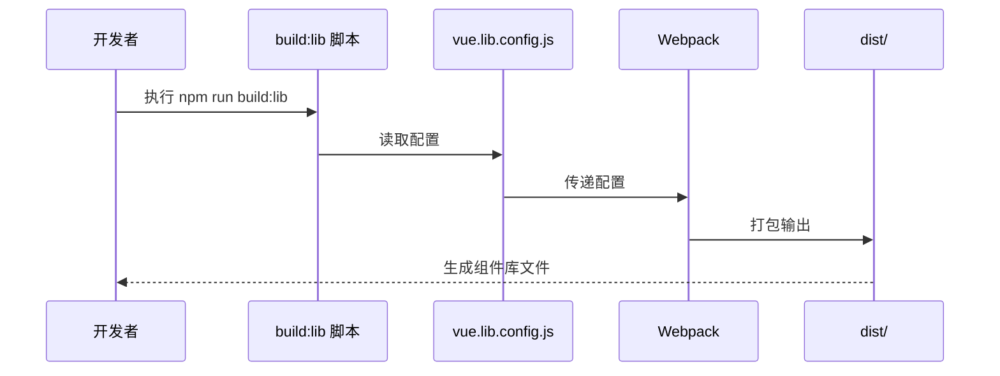

# ES-EUI 组件库打包发布计划

## 项目概述

将 `src/components/es-eui` 文件夹内容打包成独立的 npm 组件库，支持按需引入和全量引入。

## 当前项目结构分析

```
src/components/es-eui/
├── index.js              # 主入口文件
├── esDialog/             # 弹窗组件
│   ├── index.js
│   └── src/
│       ├── esDialog.vue
│       ├── draggable/
│       └── utils/
├── esForm/               # 表单组件
│   ├── index.js
│   └── src/esForm.vue
├── esTable/              # 表格组件
│   ├── index.js
│   └── src/
│       ├── esTable.vue
│       ├── columnItem.vue
│       ├── tableBtns.vue
│       └── ...
└── svgIcon/              # 图标组件
    ├── index.js
    └── src/svgIcn.vue
```

## 打包方案设计

### 1. 输出结构

```
dist/
├── es-eui.js             # UMD 格式（全量引入）
├── es-eui.min.js         # UMD 压缩格式
├── es-eui.common.js      # CommonJS 格式
├── es-eui.esm.js         # ES Module 格式
└── es-eui.css            # 样式文件
```

### 2. package.json 配置

需要修改的字段：
- `name`: `es-eui` (组件库名称)
- `version`: `1.0.0`
- `private`: `false` (允许发布到 npm)
- `main`: `dist/es-eui.common.js` (CommonJS 入口)
- `module`: `dist/es-eui.esm.js` (ES Module 入口)
- `unpkg`: `dist/es-eui.js` (CDN 入口)
- `jsdelivr`: `dist/es-eui.js` (CDN 入口)
- `files`: 指定发布的文件列表
- `scripts`: 添加打包脚本

### 3. 依赖管理

**peerDependencies** (外部依赖，不打包):
- `vue`: `^2.6.14`
- `element-ui`: `^2.15.14`

**dependencies** (内部依赖，会打包):
- 无（组件库应尽量减少内部依赖）

**devDependencies** (开发依赖):
- `@vue/cli-service`: `~5.0.8`
- `babel-loader`: `^8.2.5`
- `sass`: `^1.97.3`
- `sass-loader`: `^16.0.6`

### 4. 打包配置

使用 Vue CLI 的库模式打包，配置 `vue.config.js`:

```javascript
module.exports = {
  // 库模式配置
  configureWebpack: {
    output: {
      libraryExport: 'default'
    },
    externals: {
      vue: 'vue',
      'element-ui': 'element-ui'
    }
  },
  css: {
    extract: true
  },
  chainWebpack: config => {
    // 移除预加载插件
    config.plugins.delete('prefetch')
    config.plugins.delete('preload')
  }
}
```

### 5. .npmignore 配置

排除不需要发布的文件：
- `src/` (源码)
- `public/`
- `.env.*`
- `babel.config.js`
- `vue.config.js`
- `tests/`
- `*.md` (除了 README.md)
- `.gitignore`
- `.eslintrc.*`

### 6. 使用方式

**全量引入:**
```javascript
import EsEui from 'es-eui'
import 'es-eui/dist/es-eui.css'

Vue.use(EsEui)
```

**按需引入:**
```javascript
import { EsDialog, EsForm } from 'es-eui'
import 'es-eui/dist/es-eui.css'

Vue.use(EsDialog)
Vue.use(EsForm)
```

**使用 useDialog:**
```javascript
import { useDialog } from 'es-eui'

const dialog = useDialog(params, options)
```

## 实施步骤

### 步骤 1: 创建组件库专用的 package.json

在项目根目录创建 `package.lib.json`，包含组件库的完整配置。

**文件内容：**

```json
{
  "name": "es-eui",
  "version": "1.0.0",
  "description": "ES-EUI Component Library - Based on Vue 2.0 and Element UI",
  "author": "",
  "private": false,
  "main": "dist/es-eui.common.js",
  "module": "dist/es-eui.esm.js",
  "unpkg": "dist/es-eui.js",
  "jsdelivr": "dist/es-eui.js",
  "files": [
    "dist",
    "src/components/es-eui",
    "package.json",
    "README.md"
  ],
  "scripts": {
    "serve": "vue-cli-service serve",
    "build": "vue-cli-service build",
    "build:lib": "vue-cli-service build --target lib --name es-eui src/components/es-eui/index.js --mode production",
    "lint": "vue-cli-service lint"
  },
  "peerDependencies": {
    "vue": "^2.6.14",
    "element-ui": "^2.15.14"
  },
  "dependencies": {},
  "devDependencies": {
    "@vue/babel-preset-jsx": "^1.4.0",
    "@vue/cli-plugin-babel": "~5.0.8",
    "@vue/cli-plugin-eslint": "~5.0.8",
    "@vue/cli-plugin-router": "~5.0.8",
    "@vue/cli-plugin-vuex": "~5.0.8",
    "@vue/cli-service": "~5.0.8",
    "babel-eslint": "^10.1.0",
    "eslint": "^7.32.0",
    "eslint-plugin-vue": "^8.7.1",
    "sass": "^1.97.3",
    "sass-loader": "^16.0.6",
    "vue-template-compiler": "^2.6.14"
  },
  "keywords": [
    "vue",
    "vue2",
    "element-ui",
    "component-library",
    "ui-components",
    "es-eui",
    "dialog",
    "form",
    "table"
  ],
  "license": "MIT",
  "repository": {
    "type": "git",
    "url": ""
  },
  "bugs": {
    "url": ""
  },
  "homepage": "",
  "eslintConfig": {
    "root": true,
    "env": {
      "node": true
    },
    "extends": {
      "plugin:vue/essential",
      "eslint:recommended"
    },
    "parserOptions": {
      "parser": "babel-eslint"
    },
    "rules": {}
  },
  "browserslist": [
    "> 1%",
    "last 2 versions",
    "not dead"
  ]
}
```

### 步骤 2: 创建 .npmignore 文件

**文件路径：** `.npmignore`

**文件内容：**

```
# 开发环境文件
.env.*
.env

# 源码（已打包到 dist）
src/
public/

# 配置文件
babel.config.js
vue.config.js
vue.lib.config.js

# 测试文件
tests/
test/
*.test.js
*.spec.js

# 文档（保留 README.md）
*.md
!README.md

# Git 相关
.git/
.gitignore
.gitattributes

# IDE 相关
.vscode/
.idea/
*.swp
*.swo
*~

# 依赖
node_modules/
package-lock.json
yarn.lock

# 构建缓存
.cache/
.temp/
*.log

# 其他
.eslintrc.*
.prettierrc.*
.editorconfig
```

### 步骤 3: 创建组件库打包配置文件

**文件路径：** `vue.lib.config.js`

**文件内容：**

```javascript
const { defineConfig } = require('@vue/cli-service')

module.exports = defineConfig({
  // 库模式配置
  transpileDependencies: true,
  lintOnSave: false,
  productionSourceMap: false,

  // 配置 webpack
  configureWebpack: {
    output: {
      libraryExport: 'default'
    },
    externals: {
      vue: {
        root: 'Vue',
        commonjs: 'vue',
        commonjs2: 'vue',
        amd: 'vue'
      },
      'element-ui': {
        root: 'ELEMENT',
        commonjs: 'element-ui',
        commonjs2: 'element-ui',
        amd: 'element-ui'
      }
    }
  },

  // 提取 CSS
  css: {
    extract: true,
    loaderOptions: {
      sass: {
        additionalData: `@import "@/assets/main.scss";`
      }
    }
  },

  // 链式配置
  chainWebpack: config => {
    // 移除预加载插件
    config.plugins.delete('prefetch')
    config.plugins.delete('preload')

    // 移除 HTML 插件
    config.plugins.delete('html')
    config.plugins.delete('html-index')

    // 优化代码分割
    config.optimization.splitChunks({
      chunks: 'all',
      cacheGroups: {
        vendors: {
          test: /[\\/]node_modules[\\/]/,
          name: 'chunk-vendors',
          chunks: 'all'
        }
      }
    })

    // 配置 resolve
    config.resolve.alias.set('@', require('path').resolve(__dirname, 'src'))
  }
})
```

### 步骤 4: 创建打包脚本

在现有的 `package.json` 中添加 `build:lib` 脚本：

```json
"scripts": {
  "serve": "vue-cli-service serve",
  "build": "vue-cli-service build",
  "build:lib": "vue-cli-service build --target lib --name es-eui src/components/es-eui/index.js --mode production",
  "lint": "vue-cli-service lint"
}
```

### 步骤 5: 创建组件库 README

**文件路径：** `LIBRARY_README.md`

**文件内容：**

```markdown
# ES-EUI

基于 Vue 2.0 和 Element UI 的组件库

## 安装

```bash
npm install es-eui
```

或

```bash
yarn add es-eui
```

## 依赖

- Vue ^2.6.14
- Element UI ^2.15.14

## 使用

### 全量引入

```javascript
import Vue from 'vue'
import EsEui from 'es-eui'
import 'es-eui/dist/es-eui.css'

Vue.use(EsEui)
```

### 按需引入

```javascript
import Vue from 'vue'
import { EsDialog, EsForm, EsTable, svgIcons } from 'es-eui'
import 'es-eui/dist/es-eui.css'

Vue.use(EsDialog)
Vue.use(EsForm)
Vue.use(EsTable)
Vue.use(svgIcons)
```

### 使用 useDialog

```javascript
import { useDialog } from 'es-eui'

const dialog = useDialog({
  title: '标题',
  content: '内容'
}, {
  width: '500px'
})

dialog.open()
```

## 组件列表

- **EsDialog**: 弹窗组件，支持拖拽、嵌套等功能
- **EsForm**: 表单组件，支持动态表单、联动等
- **EsTable**: 表格组件，支持列配置、操作按钮等
- **svgIcons**: 图标组件

## 许可证

MIT
```

### 步骤 6: 修改主 package.json

在主 `package.json` 中添加 `build:lib` 脚本：

```json
"scripts": {
  "serve": "vue-cli-service serve",
  "build": "vue-cli-service build",
  "build:lib": "vue-cli-service build --target lib --name es-eui src/components/es-eui/index.js --mode production",
  "lint": "vue-cli-service lint"
}
```

### 步骤 7: 发布前准备

1. **更新 package.json**（用于发布）：
   ```bash
   cp package.lib.json package.json
   ```

2. **执行打包**：
   ```bash
   npm run build:lib
   ```

3. **检查输出**：
   确认 `dist/` 目录下生成了以下文件：
   - `es-eui.js`
   - `es-eui.common.js`
   - `es-eui.esm.js`
   - `es-eui.css`

4. **发布到 npm**：
   ```bash
   npm login
   npm publish
   ```

## 注意事项

1. **外部依赖**: Vue 和 Element UI 作为 peerDependencies，不会被打包
2. **样式提取**: CSS 需要单独提取，支持按需引入
3. **版本管理**: 遵循语义化版本规范
4. **npm 发布**: 需要先登录 npm 账号
5. **私有包**: 如果发布到私有仓库，需要配置 registry

## 架构图

```mermaid
graph TD
    A[源码 src/components/es-eui] --> B[打包配置 vue.lib.config.js]
    B --> C[Webpack 打包]
    C --> D[输出 {dist}/]
    D --> E[UMD 格式]
    D --> F[CommonJS 格式]
    D --> G[ES Module 格式]
    D --> H[样式文件]
    E --> I[npm 发布]
    F --> I
    G --> I
    H --> I
```

## 打包流程



## 文件清单

需要创建/修改的文件：

1. `package.lib.json` - 组件库的 package.json 配置
2. `.npmignore` - npm 发布忽略文件配置
3. `vue.lib.config.js` - 组件库打包配置
4. `LIBRARY_README.md` - 组件库使用文档
5. `package.json` - 添加 build:lib 脚本
